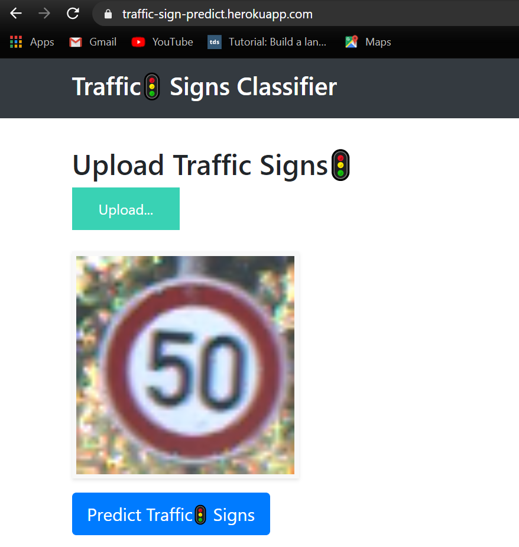
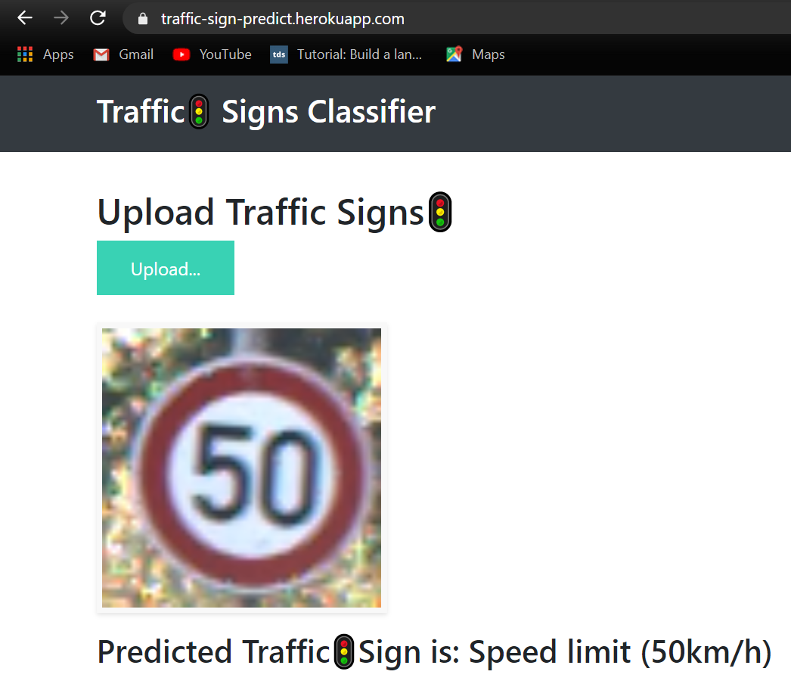

# Traffic Signs Recognition Web Application

This project is a **web-based application** for recognizing traffic signs using a deep learning model. It provides a user-friendly interface where users can upload traffic sign images and get predictions instantly. The system is powered by a trained Convolutional Neural Network (CNN) and deployed using Flask.

---

## Features

* **Traffic Sign Classification** using a pre-trained CNN model (`TSR.h5`).
* **Interactive Web Interface** to upload and classify images.
* **Visualization of Predictions** with class labels.
* **Reusable Model** trained via Jupyter notebook (`traffic_signal_recognition.ipynb`).
* **Responsive UI** with HTML, CSS, and JavaScript.

---

##  Tech Stack

* **Backend**: Python, Flask
* **Deep Learning**: Keras, TensorFlow
* **Data Handling**: NumPy, Pandas
* **Frontend**: HTML, CSS, JavaScript
* **Visualization**: Matplotlib (during training)

---

## Installation & Setup

1. **Install dependencies:**

   ```bash
   pip install -r requirements.txt
   ```

2. **Run the application:**

   ```bash
   python Traffic_app.py
   ```

3. **Open in browser:**

   ```
   http://127.0.0.1:5000/
   ```

---

##  Model Information

* The model (`TSR.h5`) is a **Convolutional Neural Network** trained on a traffic sign dataset.
* Training details and evaluation are available in `traffic_signal_recognition.ipynb`.
* You can retrain or fine-tune the model using the notebook.

---

##  Screenshots

* Example Upload Page:
  
* Prediction Result Page:
  

---

##  Future Enhancements

* Extend support for real-time video stream recognition.
* Add multilingual support for UI.
* Deploy on cloud (Heroku/AWS/GCP).

---

##  Contributing

Contributions, issues, and feature requests are welcome! Feel free to check the issues page.

